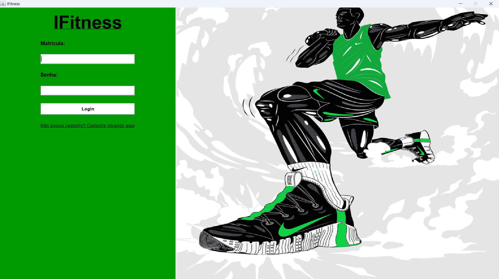

# 🏋️ IFitness - Sistema de Gerenciamento para Personal Trainer  

Projeto Acadêmico II - MyFirstSoftware, desenvolvido no âmbito da disciplina de Programação Orientada a Objetos.

**IFitness** é um sistema desktop desenvolvido em **Java**, para auxiliar instrutores no gerenciamento de alunos e treinos.

    

## 👨🏽‍💻 Funcionalidades  

✅ Cadastro e login de instrutores   
✅ Cadastro de alunos    
✅ Listagem e consulta detalhada de alunos  
✅ Criação de treinos e adição de exercícios (musculação e cardiorrespiratórios)  
✅ Remoção de alunos e treinos      

## 🛠️ Tecnologias Utilizadas  

- **Java**  
- **Swing** (Interface gráfica)  
- **Serialização de Objetos** (Persistência de dados)  
- **Padrão MVC** (Organização do código)  

## 🎮 Como Executar o Projeto  

1️⃣ Clone este repositório:  
```sh
git clone https://github.com/souzaltr/IFitness.git
```
2️⃣ Abra o projeto no Eclipse ou outra IDE compatível

3️⃣ Compile e execute a classe principal :)
